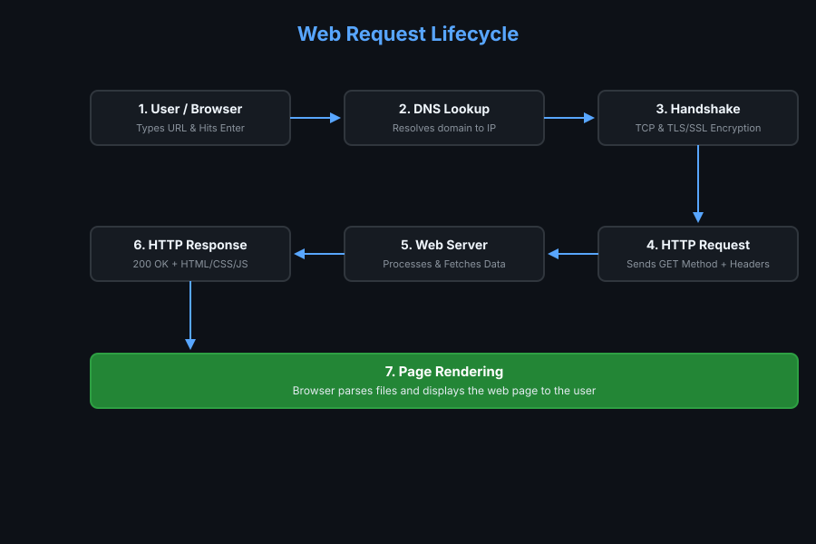

#  How the Web Works - Request Lifecycle

This repository contains a step-by-step breakdown of the lifecycle of a web request when a user inputs a URL into a browser and hits **Enter**.

---

## Request Lifecycle Diagram

---

##  Step-by-Step Explanation

### 1️ User Request (Client)
The user enters a web URL (e.g., `https://www.google.com`) into the browser address bar and presses **Enter**. The browser first checks its local cache and the OS cache to see if the IP address is already known.

### 2️ DNS Lookup
If the domain IP is not cached, the browser queries a **DNS (Domain Name System)** server to translate the human-readable domain name into a machine-readable IP address (e.g., `142.250.190.46`).

### 3️ TCP & TLS/SSL Handshake
Once the IP address is resolved, the client initiates a **TCP Handshake** to establish a connection with the server. Since HTTPS is used, a **TLS/SSL Handshake** follows immediately to negotiate encryption keys and secure the connection.

### 4️ HTTP Request
The browser sends an HTTP Request (e.g., `GET / HTTP/1.1`) containing HTTP request headers (User-Agent, Accept, Cookies) to fetch the requested web resources.

### 5️ Server Processing & Load Balancer
The request reaches the target web server (often passing through a Load Balancer or Reverse Proxy first). The server handles the request, validates authorization, interacts with databases, and prepares the response payload.

### 6️ HTTP Response
The web server sends back an HTTP Response containing:
- **Status Code:** e.g., `200 OK`
- **Response Headers:** `Content-Type`, `Cache-Control`, etc.
- **Response Body:** HTML, CSS, JavaScript, and assets.

### 7️ Browser Rendering
The browser parses the received HTML, downloads referenced resources (CSS, JS, images), constructs the DOM tree, and renders the fully visible webpage on the screen.
